# AUTHORIZATION_ARCHITECTURE.md (evidence-based)

## Scope note
This document is built only from code that was directly read during this audit session:
- `planbuddy_v9/app.js`
- `planbuddy_v9/routes/index.js`
- `planbuddy_v9/routes/internal.js`
- `planbuddy_v9/routes/auth.js`
- `planbuddy_v9/middleware/index.js`
- `planbuddy_v9/middleware/rateLimit.js`
- `planbuddy_v9/middleware/validation.js`
- `planbuddy_v9/middleware/idempotency.js`
- `planbuddy_v9/middleware/internalIpGuard.js`
- `planbuddy_v9/utils/jwt.js`
- `planbuddy_v9/controllers/authController.js`
- `planbuddy_v9/controllers/bookingController.js`
- `planbuddy_v9/controllers/paymentController.js`
- `planbuddy_v9/controllers/razorpayWebhookController.js`
- `planbuddy_v9/middleware/proxyValidation.js`
- `planbuddy_v9/middleware/backpressure.js`
- `planbuddy_v9/controllers/healthController.js`
- `planbuddy_v9/controllers/queueMetricsController.js`
- `planbuddy_v9/config/env.js`
- `planbuddy_v9/workers/index.js`
- `planbuddy_v9/workers/webhook-processor.worker.js`
- `planbuddy_v9/workers/sessionCleanup.worker.js`
- `planbuddy_v9/workers/payment-reconciliation-queue.worker.js`
- `planbuddy_v9/workers/start-webhook.js`

Any architecture elements not evidenced by these files are marked **UNKNOWN**.

---

## 1) Authentication architecture (AuthN)

### 1.1 JWT Bearer verification middleware
**File:** `planbuddy_v9/middleware/index.js`

**Exported function:**
- `authenticate(req, res, next)`

**Enforcement evidence:**
- Requires header `Authorization: Bearer <token>`; otherwise `401`.
- Verifies JWT with `verifyToken(token)` from `planbuddy_v9/utils/jwt.js`.
- Enforces token revocation using `isRevoked(decoded.jti, userId, decoded.iat, db, redis)`.
- Enforces session invalidation after password change using `isTokenBeforePasswordChange(userId, decoded.iat)`.
- Enforces user active status using `isUserActive(userId)` (Redis cache + DB fallback).
- On success sets `req.user = { id, role, jti }`.

**UNKNOWN:**
- Exact JWT claim semantics beyond what is read (example: whether `decoded.sub` vs `decoded.id` is guaranteed across issuers). Evidence shows code uses `decoded.sub || decoded.id`.

### 1.2 JWT crypto and revocation storage
**File:** `planbuddy_v9/utils/jwt.js`

**Exports evidenced:**
- `verifyToken(token)` using HS256 and `getJwtSecret()`.
- `isRevoked(jti, userId, iat, db, redis)` checks:
  - Redis blacklist key `jwt:blacklist:<jti>`.
  - Redis “revoke all” marker `jwt:revoked_all:<userId>`.
  - DB `token_blacklist` table for `jti` and `revoke_all_*` markers.

---

## 2) Authorization architecture (AuthZ)

### 2.1 RBAC middleware
**File:** `planbuddy_v9/middleware/index.js`

**Exported function:**
- `requireRole(...roles)`

**Enforcement evidence:**
- Checks `req.user` exists (else `401`).
- Requires `req.user.role` in provided role list (else `403`).

**UNKNOWN:**
- Full role catalogue and assignments/administration logic across all routes/services.

### 2.2 Role values in evidenced code paths
**File:** `planbuddy_v9/controllers/authController.js`

**Verified constraint:**
- Registration endpoint normalizes roles to one of `['user','agency']`; other values are silently forced to `'user'`.

**Verified enforcement usage:**
- Admin routes use `requireRole('admin')`.

**UNKNOWN:**
- How `admin` role is assigned to existing users.

---

## 3) Ownership / resource-level checks

### 3.1 Booking ownership and access exception
**File:** `planbuddy_v9/controllers/bookingController.js`

**Verified checks:**
- `getBooking`: denies access if `booking.user_id !== req.user.id` AND `req.user.role` is not `'admin'` AND not `'agency'`.
- `cancelBooking`: denies access if `existing.user_id !== req.user.id` AND `req.user.role` is not `'admin'`.

**UNKNOWN:**
- Ownership checks for other resources (refunds, documents, notifications, audit logs) because their controllers/services were not read in this session.

### 3.2 Payment status ownership
**File:** `planbuddy_v9/controllers/paymentController.js`

**Verified check:**
- `getPaymentStatus` SQL uses:
  - `WHERE (p.id = $1 OR p.razorpay_payment_id = $1) AND (p.user_id = $2 OR $3 = 'admin')`

---

## 4) Internal service / internal endpoints authorization

### 4.1 Internal observability routes
**File:** `planbuddy_v9/app.js`
- Mounts `/internal` as: `app.use('/internal', internalIpGuard, internalRoutes)`

**File:** `planbuddy_v9/middleware/internalIpGuard.js`
- `internalIpGuard` checks request IP against `env.INTERNAL_ALLOWED_IPS` and returns `403` otherwise.

**File:** `planbuddy_v9/routes/internal.js`
- No JWT middleware in router; relies entirely on IP guard.

**UNKNOWN:**
- Whether `INTERNAL_ALLOWED_IPS` is always securely configured in production (env enforces required configuration only in `env.js` for PROD; exact value depends on deployment).

### 4.2 /metrics
**File:** `planbuddy_v9/app.js`
- `/metrics` is guarded via `env.METRICS_ALLOWED_IPS.includes(clientIp)`.

---

## 5) Admin authorization architecture

### 5.1 Admin RBAC enforcement
**File:** `planbuddy_v9/routes/index.js`

- `GET /admin/bookings`
  - Middleware chain evidenced: `authenticate, requireRole('admin'), validateAll(...)`
- `POST /admin/payments/:paymentId/reconcile`
  - Middleware chain evidenced: `authenticate, requireRole('admin'), validateAll(...), idempotency.strict`

**UNKNOWN:**
- Admin capabilities outside the two verified admin routes.

---

## 6) Worker authorization

### 6.1 Workers process privileged mutations without user context
**File:** `planbuddy_v9/workers/webhook-processor.worker.js`
- Consumes `webhook_events` and runs:
  - `applyPaymentEvent` and `applyRefundEvent` from `planbuddy_v9/controllers/razorpayWebhookController.js`.
- Worker does not perform JWT authorization; relies on webhook ingestion security.

**File:** `planbuddy_v9/controllers/razorpayWebhookController.js`
- Ingestion verifies Razorpay HMAC signature and timestamp, then writes to DB and enqueues.

**UNKNOWN:**
- Whether other worker entrypoints (refund retries, email dispatch, dlq processor, outbox relay) enforce additional authorization/guarding against unauthorized job payloads; those files were not read in this session.

---

## 7) Webhook authorization

### 7.1 Razorpay webhook admission control
**File:** `planbuddy_v9/controllers/razorpayWebhookController.js`

**Verified admission gates:**
- Requires raw body bytes via `express.raw` route handling (otherwise 500 with `MISSING_RAW_BODY`).
- Enforces timestamp freshness using `webhookAuthenticityService.verifyIngressTimestamp(timestamp, ...)`.
- Enforces HMAC signature using `verifySignature(rawBody, signature)` (RAZORPAY_WEBHOOK_SECRET).
- Extracts `provider_event_id` only from genuine envelope fields (`parsed.id` or `parsed.event_id` or `parsed.payload.event.id`); rejects 400 if missing.
- Deduplicates via DB `ON CONFLICT (provider, provider_event_id) DO NOTHING`.

---

## 8) Dependency graph (evidence-based subset)

```mermaid
graph TD
  app[planbuddy_v9/app.js] --> routesIndex[planbuddy_v9/routes/index.js]
  app --> routesInternal[planbuddy_v9/routes/internal.js]

  routesIndex --> authM[planbuddy_v9/middleware/index.js]
  routesIndex --> ctrlBooking[planbuddy_v9/controllers/bookingController.js]
  routesIndex --> ctrlPayment[planbuddy_v9/controllers/paymentController.js]
  routesIndex --> ctrlWebhook[planbuddy_v9/controllers/razorpayWebhookController.js]

  authM --> jwtUtils[planbuddy_v9/utils/jwt.js]
  authM --> db[planbuddy_v9/config/db.js]
  authM --> redis[planbuddy_v9/config/redis.js]

  app --> internalIp[planbuddy_v9/middleware/internalIpGuard.js]
  app --> proxyVal[planbuddy_v9/middleware/proxyValidation.js]
  app --> backpressure[planbuddy_v9/middleware/backpressure.js]
  app --> globalLimiter[planbuddy_v9/middleware/rateLimit.js]

  ctrlWebhook --> db
  ctrlWebhook --> queues[planbuddy_v9/config/queues.js]
  ctrlWebhook --> webhookAuth[planbuddy_v9/services/webhookAuthenticityService.js] 

  workerWebhook[planbuddy_v9/workers/webhook-processor.worker.js] --> ctrlWebhookApply[applyPaymentEvent/applyRefundEvent]
  workerWebhook --> db

  workerWebhook --> reliability[planbuddy_v9/utils/queueReliabilityState.js]
```

**UNKNOWN:** `queueMetricsController` dependency graph inside queueMonitoring not fully read.

---

## 9) Evidence-based “protected surfaces” summary (partial)

### Verified protected routes (from read files)
- `/api/v1/bookings` → authenticated
- `/api/v1/bookings/:bookingId` → authenticated + ownership checks in controller
- `/api/v1/bookings/:bookingId/cancel` → authenticated + ownership checks in controller
- `/api/v1/payment/create-order` → authenticated + idempotency.strict
- `/api/v1/payment/verify` → authenticated + idempotency.strict
- `/api/v1/payment/status/:paymentId` → authenticated + payment ownership in SQL
- `/api/v1/admin/bookings` → authenticated + RBAC admin
- `/api/v1/admin/payments/:paymentId/reconcile` → authenticated + RBAC admin + idempotency.strict

### Verified internal surfaces
- `/internal/*` → IP allowlist only (no JWT)

### Verified webhook surface
- `/api/v1/payment/webhook/razorpay` → raw body + timestamp + HMAC + provider_event_id dedup

### UNKNOWN protected surfaces
- Any routes not present in the files read.
- Any services/workers entrypoints not read in this session.
- Any DB ownership filters not shown in the controllers read.

